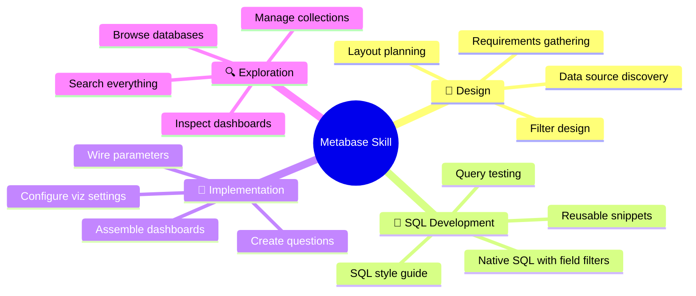
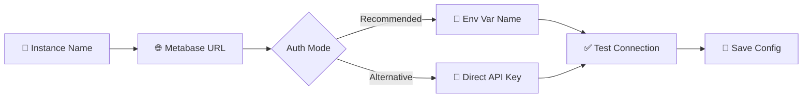
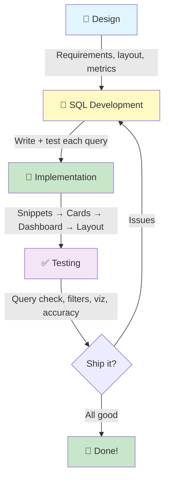

# 📊 Metabase Skill

> **Your AI-powered BI developer for Metabase.** Design dashboards, write SQL, create questions and snippets, assemble layouts with filters and viz settings, test and ship — all from the command line. Covers the full lifecycle from requirements to production dashboard.

Works with **any AI coding agent** — Claude Code, Cursor, Codex, and more.

```
🎨 Design → SQL → Deploy     📦 Zero dependencies     🔌 Any AI agent     🏢 Multi-instance
```

## 📑 Table of Contents

- [✨ What can it do?](#-what-can-it-do)
- [🚀 Quick Start](#-quick-start)
- [📖 CLI Commands](#-cli-commands)
  - [🔍 Discovery](#-discovery)
  - [📝 Cards (Questions)](#-cards-questions)
  - [📋 Dashboards](#-dashboards)
  - [🧩 Snippets](#-snippets)
  - [📁 Collections](#-collections)
- [🔄 Recommended Workflow](#-recommended-workflow)
- [💬 Example Prompts](#-example-prompts)
- [📈 What You Can Build](#-what-you-can-build)
- [🛡️ Safety](#️-safety)
- [📂 Project Structure](#-project-structure)
- [⚙️ Configuration](#️-configuration)
- [🧰 Prerequisites](#-prerequisites)
- [🔐 Security](#-security)
- [📜 License](#-license)

## ✨ What can it do?



## 🚀 Quick Start

### 1. Install

```bash
npx skills add onsen-ai/metabase-skill
```

Or install globally:

```bash
npx skills add onsen-ai/metabase-skill -g
```

> See [vercel-labs/skills](https://github.com/vercel-labs/skills) for more install options.

### 2. Setup

Run the interactive wizard in your terminal:

```bash
node scripts/metabase.mjs setup
```

The wizard walks you through:



Supports **multiple instances** (production, staging, etc.). Config saved to `~/.metabase-skill/config.json` — re-run anytime to add or change instances.

### 3. Go!

```bash
node scripts/metabase.mjs databases
```

That's it. All commands auto-detect your saved connection. 🎉

## 📖 CLI Commands

### 🔍 Discovery

| Command | What it does | Example |
| ------- | ------------ | ------- |
| `databases` | List all databases | `databases` |
| `tables` | Browse tables with field details | `tables --database 1` |
| `collections` | Browse collection hierarchy | `collections --tree` |
| `collection-items` | List items in a collection | `collection-items 8 --models card,dashboard` |
| `search` | Find anything by name | `search revenue --models card` |

> 💡 Discovery commands output **formatted text** by default. Add `--json` for structured output.

### 📝 Cards (Questions)

| Command | What it does | Example |
| ------- | ------------ | ------- |
| `card <id>` | Card summary (compact, safe for LLM) | `card 402` |
| `card <id> --full --out <file>` | Full card → file (never to stdout) | `card 402 --full --out card.json` |
| `card create --from <file>` | Create card from JSON spec | `card create --from spec.json` |
| `card update <id> --patch <file>` | GET-merge-PUT (smart patching) | `card update 402 --patch patch.json` |
| `card delete <id>` | Delete a card | `card delete 402` |
| `card copy <id>` | Duplicate a card | `card copy 402 --collection 8` |
| `card query <id>` | Execute and see results | `card query 402` |

### 📋 Dashboards

| Command | What it does | Example |
| ------- | ------------ | ------- |
| `dashboard <id>` | Dashboard summary (tabs, cards, params) | `dashboard 22` |
| `dashboard <id> --layout --out <file>` | Lightweight layout (no card objects!) | `dashboard 22 --layout --out layout.json` |
| `dashboard <id> --full --out <file>` | Full payload → file | `dashboard 22 --full --out full.json` |
| `dashboard create --from <file>` | Create empty dashboard shell | `dashboard create --from shell.json` |
| `dashboard put <id> --from <file>` | Direct PUT (LLM-built payload) | `dashboard put 22 --from layout.json` |
| `dashboard update <id> --patch <file>` | Smart GET-merge-PUT | `dashboard update 22 --patch patch.json` |
| `dashboard delete <id>` | Delete a dashboard | `dashboard delete 22` |
| `dashboard copy <id>` | Duplicate a dashboard | `dashboard copy 22 --collection 8` |
| `dashcard <id> <index\|name>` | Inspect one dashcard's config | `dashcard 22 "Revenue"` |

> 💡 **Dashboard PUT payloads are lightweight** — the embedded `card` objects are read-only and stripped. A 30-card dashboard layout is ~3K tokens. The LLM can construct these directly.

### 🧩 Snippets

| Command | What it does | Example |
| ------- | ------------ | ------- |
| `snippets` | List all snippets | `snippets` |
| `snippet <id>` | Show snippet SQL content | `snippet 6` |
| `snippet create` | Create a reusable SQL fragment | `snippet create --name order_base --content "SELECT ..."` |
| `snippet update <id>` | Update snippet content | `snippet update 6 --content "SELECT ..."` |

### 📁 Collections

| Command | What it does | Example |
| ------- | ------------ | ------- |
| `collection create` | Create a new collection | `collection create --name "Reports" --parent 3` |
| `collection update <id>` | Rename, move, or archive | `collection update 8 --name "New Name"` |

### 🌐 Global Options

| Option | Description |
| ------ | ----------- |
| `--instance <name>` | Override default instance (e.g., `--instance staging`) |
| `--json` | Structured JSON output (discovery commands) |

## 🔄 Recommended Workflow



> 💡 **Don't follow this rigidly!** If the user says "show me revenue by month as a bar chart", skip straight to SQL. This is a guide for complex multi-card dashboards, not a mandatory checklist.

### When to use SQL vs MBQL

| Use SQL (native) when | Use MBQL when |
| --------------------- | ------------- |
| Complex CTEs, window functions | Simple count/sum + breakout |
| Period-over-period comparisons | Standard temporal bucketing |
| Team needs to review the SQL | Quick ad-hoc questions |
| Reusable base data (snippets!) | Single-table queries |
| Performance-tuned queries | Metrics that should be reusable |

> 💡 **SQL is generally preferred** — it's code that can be reviewed, versioned, and reused via snippets.

## 💬 Example Prompts

Here's what you can ask. The skill handles everything from quick one-liners to complex multi-step workflows.

### Creating dashboards

```
"Build a sales dashboard with revenue KPIs, a monthly trend, and a category breakdown. 
Use our Redshift DWH. Add date and country filters."

"Create a quick dashboard with 3 scalar cards: total users, active users, churn rate."

"Design a trading performance dashboard — I want to see the full mockup before we build."
```

### Organising collections

```
"Our Metabase is a mess. Scan the Commercial collection and suggest how to reorganise it — 
group dashboards by domain, move orphaned questions into sub-collections."

"Rename all dashboards in collection 8 to follow our naming convention: [Domain] Name (v1.0)"

"Create a new collection structure: Trading > Weekly, Trading > Monthly, Trading > Ad Hoc"
```

### Working with SQL

```
"Write a parameterised SQL question showing monthly revenue by category with date and 
category filters. Use field filter syntax and follow the SQL style guide."

"Create a reusable snippet called 'order_base' that joins orders with products and customers."
```

### Editing and improving

```
"Add a Regional Breakdown tab to dashboard 42 with revenue by state and a top stores table."

"Fix the date filter on dashboard 22 — it's not connected to the Revenue by State card."

"Improve the formatting on dashboard 39: currency for revenue columns, percentages for 
rates, consistent chart colours, and add descriptions to all cards."
```

### Exploring

```
"What dashboards do we have about customer analytics?"

"Explain what dashboard 109 does — cards, filters, how they're connected."

"Show me the table schema for database 2 — I need to understand the data model."
```

## 📈 What You Can Build

The skill handles real-world BI patterns — KPI scorecards, trading dashboards, performance reports, analyst deep-dives.

| Pattern | Approach |
| ------- | -------- |
| 📊 **KPI Scorecard** | Scalar cards with smartscalar comparisons (previousPeriod, periodsAgo) |
| 📈 **Trend Dashboard** | Line charts with temporal breakout, stacked bars for category mix |
| 📋 **Detail Table** | Tables with conditional formatting, column_settings for currency/% |
| 🔗 **Drill-Down** | Click behaviors linking cards to filtered views |
| 🎯 **Filtered Report** | Field filters with cascading parameters, optional clause syntax |
| 🧩 **Reusable SQL Layer** | Snippets for base data CTEs shared across 10+ cards |
| 📊 **Mixed Viz Dashboard** | Scalar KPIs + line trends + bar breakdowns + data tables |

## 🛡️ Safety

### Context safety

The skill is designed for **agentic use** (the LLM is the primary user). Two rules protect the context window:

| Rule | How |
| ---- | --- |
| **Never load full payloads** | `card` and `dashboard` commands return compact summaries. Full objects go to files via `--out`. |
| **File-based mutations** | JSON payloads are written to files, then passed to `create`/`put`/`update`. Large JSON stays out of context. |

### API safety

| Rule | How |
| ---- | --- |
| **No accidental deletes** | Delete commands require explicit invocation. Prefer archiving (`--archived true`). |
| **Secrets never in output** | API keys read from env vars at runtime. Never printed to stdout. |
| **Smart patching** | `update` commands do GET-merge-PUT — you only write the delta, existing data is preserved. |

### SQL safety

| Rule | How |
| ---- | --- |
| **Always test before deploying** | Run `card query` before creating Metabase questions |
| **SQL files are source of truth** | Save SQL to disk first — enables review and version control |
| **NULLIF on division** | SQL style guide enforces divide-by-zero protection |

## 📂 Project Structure

```
metabase-skill/
├── SKILL.md                       # Skill definition (loaded by Claude Code)
├── README.md                      # This file
├── scripts/                       # CLI — Node.js, zero dependencies
│   ├── metabase.mjs               #   Entry point
│   ├── test-e2e.mjs               #   Smoke test (29 tests)
│   └── lib/                       #   Client, commands, utilities
├── specs/                         # API reference docs (7 files, ~35K tokens)
│   ├── dashboard-api-spec.md      #   Dashboard CRUD, layout, parameters
│   ├── card-api-spec.md           #   Card CRUD, MBQL, native SQL, field filters
│   ├── visualization-cookbook.md   #   54 copy-pasteable viz examples
│   ├── collection-api-spec.md     #   Collection tree, items, CRUD
│   ├── discovery-api-spec.md      #   Database/table/field metadata, search
│   ├── snippet-api-spec.md        #   Snippet CRUD, nesting, composition
│   └── sql-style-guide.md         #   SQL formatting conventions
├── assets/templates/              # Design doc, text mockup, HTML mockup templates
└── evals/                         # 13 test cases (8 read + 5 write)
```

## ⚙️ Configuration

**Single instance:**

```json
{
  "default": "production",
  "instances": {
    "production": {
      "url": "https://metabase.example.com",
      "keyEnvVar": "METABASE_API_KEY"
    }
  }
}
```

**Multiple instances:**

```json
{
  "default": "production",
  "instances": {
    "production": {
      "url": "https://metabase.example.com",
      "keyEnvVar": "METABASE_PROD_KEY"
    },
    "staging": {
      "url": "https://staging.metabase.example.com",
      "keyEnvVar": "METABASE_STAGING_KEY"
    }
  }
}
```

**Direct key storage** (if you pick `direct` mode during setup, the key itself is written to config — the file is chmod 0600):

```json
{
  "default": "production",
  "instances": {
    "production": {
      "url": "https://metabase.example.com",
      "apiKey": "mb_..."
    }
  }
}
```

Edit directly or re-run `node scripts/metabase.mjs setup`.

## 🧰 Prerequisites

- **Node.js 18+** — stdlib only, no npm packages needed
- **Metabase API key** — generated in Metabase Admin → Settings → API Keys

> 💡 Store your API key in an environment variable (e.g., `export METABASE_API_KEY="mb_..."`) and reference the variable name during setup. This way secrets never touch disk.

## 🔐 Security

### No secrets in config (recommended)

The skill's config stores the **name of the env var** holding your API key, not the key itself. At runtime, it reads the env var. Your API key never appears in config files, output, or logs.

```
Config says: "keyEnvVar": "METABASE_API_KEY"
At runtime:  reads process.env.METABASE_API_KEY
```

### Alternative: direct key storage

For convenience, you can store the API key directly during setup. It's saved in `~/.metabase-skill/config.json`. If you do this, ensure the file has appropriate permissions.

### Context safety for LLMs

Full Metabase API responses can be 100K-1M tokens (dashboards embed complete card objects). The CLI **never** returns these to stdout. Summary mode returns compact metadata (<2K tokens). Full objects are written to files via `--out`. This prevents accidental context window overflow.

## Built by

Built by the team at [Onsen](https://www.onsenapp.com) — an AI-powered mental health companion for journaling, emotional wellbeing, and personal growth.

## 📜 License

MIT
